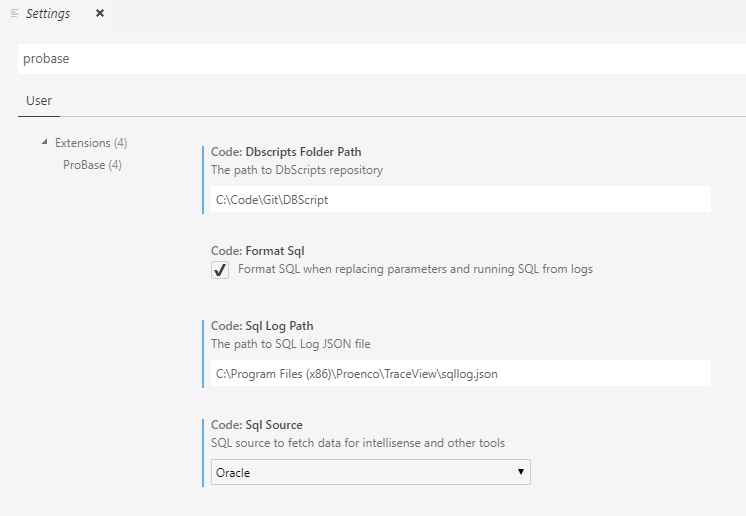

# ProBase

This extension is meant to help database code management for ProArc

## Features

* Go to Definition and Peek Definition for tables
* Load tables and columns documentation as intellisense
* Configure whether to source definitions from MS SQL or Oracle
* Replace SQL parameter values from Traceview logs
* Remove database names from SQL queries
* View SQL logs from Diagnostics trace
* Export SQL logs and view exported logs

## Configuration

### Settings
Before using the extension it is recommended to set up the following.
Go to `File > Preferences > Settings` and in the settings for probase configure these values
* code.dbscriptsFolderPath - The path to the DbScripts repository. Ensure you have the latest changes.
> eg C:\Code\Git\DbScript
* code.formatSQl - If this is selected, SQL is auto formatted when replacing parameters and running SQL from logs
* code.sqlLogPath - The path to sql log file as set in registry at path `Software\Wow6432Node\Proenco\InfoCenter\Settings`
* code.sqlSource - Whether to use MS SQL source or Oracle source.

## Requirements

   Azure Data Studio version should be higher than 1.7

   VS Code version should be higher than 1.33.0

